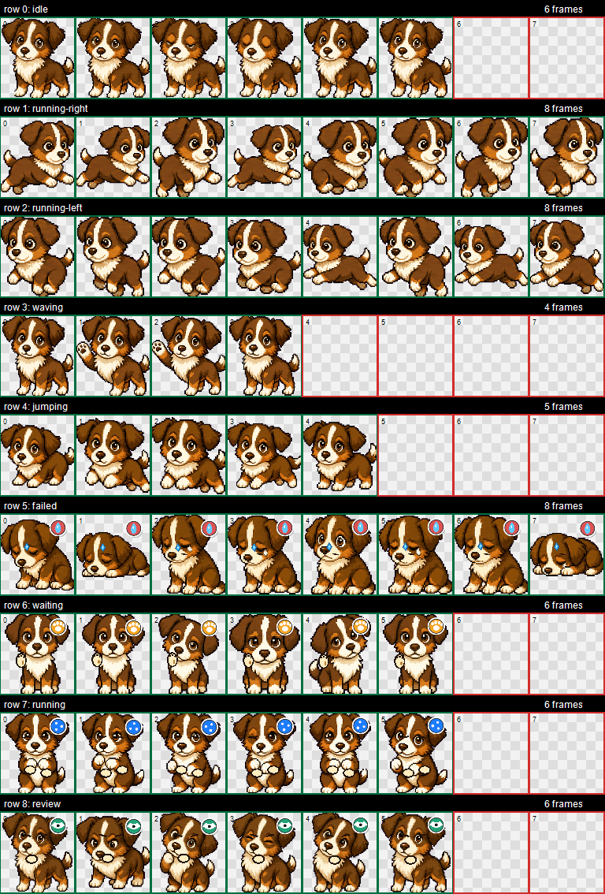

# Malou Codex Pet

[](https://github.com/mySebbe/malou-codex-pet/releases/latest)
[](LICENSE.md)



Malou is a custom Codex Desktop pet based on a brown-and-white dog companion. The package contains the ready-to-install `pet.json` and `spritesheet.webp`, plus curated source frames and preview media for anyone who wants to inspect the atlas.

This is not an official OpenAI or Codex asset.

## Install

### Windows PowerShell

```powershell
git clone https://github.com/mySebbe/malou-codex-pet.git
cd malou-codex-pet
.\scripts\install.ps1
```

Manual install:

```powershell
$target = Join-Path $HOME ".codex\pets\malou"
New-Item -ItemType Directory -Force -Path $target | Out-Null
Copy-Item ".\dist\malou\pet.json" $target -Force
Copy-Item ".\dist\malou\spritesheet.webp" $target -Force
```

Then restart Codex Desktop and select `Malou` as the active pet.

### macOS or Linux

```bash
git clone https://github.com/mySebbe/malou-codex-pet.git
cd malou-codex-pet
mkdir -p "${CODEX_HOME:-$HOME/.codex}/pets/malou"
cp dist/malou/pet.json "${CODEX_HOME:-$HOME/.codex}/pets/malou/"
cp dist/malou/spritesheet.webp "${CODEX_HOME:-$HOME/.codex}/pets/malou/"
```

## Compatibility

Tested as a Codex Desktop custom pet package on 2026-05-09.

## Previews

| State | Preview |
| --- | --- |
| `idle` | [`idle.mp4`](assets/previews/idle.mp4) |
| `running-right` | [`running-right.mp4`](assets/previews/running-right.mp4) |
| `running-left` | [`running-left.mp4`](assets/previews/running-left.mp4) |
| `waving` | [`waving.mp4`](assets/previews/waving.mp4) |
| `jumping` | [`jumping.mp4`](assets/previews/jumping.mp4) |
| `failed` | [`failed.mp4`](assets/previews/failed.mp4) |
| `waiting` | [`waiting.mp4`](assets/previews/waiting.mp4) |
| `running` | [`running.mp4`](assets/previews/running.mp4) |
| `review` | [`review.mp4`](assets/previews/review.mp4) |

## Package

| File | Purpose |
| --- | --- |
| `dist/malou/pet.json` | Codex pet manifest |
| `dist/malou/spritesheet.webp` | Transparent animated pet atlas |
| `assets/contact-sheet.png` | Visual overview of the atlas |
| `assets/previews/*.mp4` | Short animation previews by state |
| `source/frames/` | Curated transparent frame sources |
| `source/row-strips/` | Row-level atlas strips |
| `metadata/atlas.json` | Public atlas metadata and checksums |

## Atlas Specs

| Property | Value |
| --- | --- |
| Pet id | `malou` |
| Version | `1.0.0` |
| Atlas format | WebP, RGBA |
| Atlas size | `1536 x 1872` |
| Grid | `8 x 9` |
| Cell size | `192 x 208` |
| Unused cells | Transparent |
| Main spritesheet SHA-256 | `09df813e132d69f9e03a652ef0c14d51fcb30ac79f4ead9d026c5c5c13b9f5bb` |

## Animations

| State | Row | Frames |
| --- | ---: | ---: |
| `idle` | 0 | 6 |
| `running-right` | 1 | 8 |
| `running-left` | 2 | 8 |
| `waving` | 3 | 4 |
| `jumping` | 4 | 5 |
| `failed` | 5 | 8 |
| `waiting` | 6 | 6 |
| `running` | 7 | 6 |
| `review` | 8 | 6 |

## Verify

```powershell
.\scripts\verify.ps1
```

Expected core checksums are listed in `SHA256SUMS.txt`.

## Privacy

This public repository intentionally excludes raw private generation data:

- original private photo/reference material
- prompt dumps and job logs
- local Codex state files
- local install-repair scripts and backups
- tokens, passwords, API keys, or machine-specific paths

The files included here are the curated public pet package, visual source frames, row strips, preview media, and sanitized metadata.

## License

Code, scripts, documentation, and metadata are MIT licensed.

Malou artwork assets in `dist/`, `assets/`, and `source/` are licensed under CC BY-NC 4.0 unless another written permission is granted by the owner.

See `LICENSE.md` and `ATTRIBUTION.md`.
